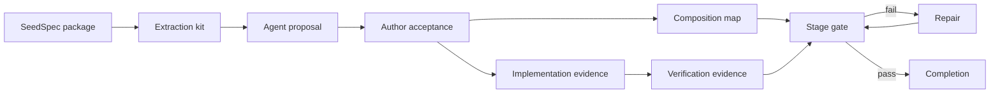

# SeedSpec 0.4 capability experiment

Status: experimental. This directory does not change Protocol 0.3 or publish a
package.

Read [`HYPOTHESIS.md`](HYPOTHESIS.md) for the decision frame,
[`RESULTS.md`](RESULTS.md) for the artifact screen, and
[`PILOT-RESULTS.md`](PILOT-RESULTS.md) for the first enforcement comparison.

## Hypothesis

Capability formatting alone will not materially improve a capable model. A
source-bound capability rubric can improve implementation correctness when a
tool actively checks coverage and prevents unsupported completion.

The experiment therefore separates three layers:

1. **Protocol** — portable meaning, authority, provenance, configuration, and
   reuse.
2. **CLI and instructions** — source-bound extraction, explicit author
   acceptance, and stage reports.
3. **Harness enforcement** — required checks, repair turns, termination control,
   and telemetry.

The experiment adds no domain ontology. Capability names, outcomes, acceptance
meaning, and integration descriptions remain author- and agent-written.

## Relationship to existing capabilities

Protocol 0.3 already defines reusable Markdown capability contracts, semantic
versions, requirements, and conformance suites. This experiment extends that
model. It does not introduce a second kind of capability.

The proposed 0.4 bundle adds:

- exact package and source-section binding;
- explicit author acceptance;
- outcome-level implementation rubrics;
- deterministic or nondeterministic verification declarations;
- package-local integration offers and needs; and
- digest-bound evidence at each lifecycle stage.

The structured bundle is the machine-readable companion. A `CAPABILITY.md`
file remains the primary human and agent entry point, like a Skill file with
supporting checks and references.

## Lifecycle



### Prepare an extraction kit

Run:

```sh
node packages/cli/bin/seedspec.js capabilities prepare <package> \
  --output <empty-directory>
```

The command validates the package. It writes a content-bound source kit, an
output schema, and model instructions. It does not call a model or change the
package.

### Check a proposed bundle

Run:

```sh
node packages/cli/bin/seedspec.js capabilities check <package> \
  --bundle <proposal.yaml> \
  --stage authoring
```

The gate checks source references, identifier uniqueness, acceptance coverage,
verification declarations, and package identity.

### Record author acceptance

Run:

```sh
node packages/cli/bin/seedspec.js capabilities accept <package> \
  --bundle <proposal.yaml> \
  --accepted-by <author-identity> \
  --output <accepted.yaml>
```

The command writes a new accepted artifact. It does not edit the proposal or
the package.

### Check later stages

Run:

```sh
node packages/cli/bin/seedspec.js capabilities check <composition-root> \
  --bundle <accepted.yaml> \
  --stage <composition|implementation|verification> \
  --evidence <stage-evidence.yaml>
```

The composition gate checks declared endpoints and required joins. It does not
claim that the mapping is semantically correct. The implementation gate checks
outcome coverage. The verification gate requires passing evidence for every
acceptance check.

## Pi harness

[`pi-harness`](pi-harness/) is a small Pi package. It uses Pi's extension
events, custom tools, and terminating tool results.

The extension:

- injects the active capability stage into each model turn;
- exposes explicit check and completion tools;
- refuses its completion path while the CLI gate fails;
- requests bounded repair turns when an agent stops early; and
- writes hashed tool and gate telemetry without raw prompts or tool inputs.

Model and gateway selection remain Pi configuration. The SeedSpec extension is
provider-independent and does not maintain its own model catalog.

This tests harness enforcement without building an agent runtime from scratch.
The package currently targets the maintained `@earendil-works/pi-*` package
names. It is not installed by the repository.

## Current screen

The daily-pipeline example maps the existing ten-check downstream evaluator to
an accepted capability bundle.

| Realization | Behavioral checks | Capability gate |
| --- | ---: | --- |
| Reference | 10/10 | pass |
| Known weak | fewer than 5/10 | fail |

This establishes that the evidence adapter and gate discriminate known good and
bad realizations. It does not establish a model-treatment effect.

## Enforcement pilot

Three fresh runs per condition compared the same accepted bundle and initial
instructions with and without an active repair controller.

| Condition | First full conformance | Final full conformance |
| --- | ---: | ---: |
| Instructions only | 1/3 | 1/3 |
| Actively enforced | 1/3 | 3/3 |

Both conditions had the same first-pass distribution. Enforcement repaired the
two incomplete implementations in one turn each. See
[`PILOT-RESULTS.md`](PILOT-RESULTS.md) for cost and limits.

Run the pilot with:

```sh
npm run capability-evals:pilot -- \
  --repetitions 3 \
  --model gpt-5.6-terra \
  --reasoning medium \
  --confirm-model-execution
```

Local run artifacts are written under `runs/` and ignored by Git.

## Next causal test

Use one frozen package, model, scaffold, and hidden evaluator. Run at least
three fresh repetitions per condition:

1. Prompt and CLI instructions only.
2. The same capability bundle with active enforcement.

Measure:

- first-attempt and final full conformance;
- escaped critical defects;
- ignored or fabricated evidence;
- repair turns;
- input and output tokens;
- tool calls and elapsed time; and
- harness failures independent of model failures.

Repeat on a second failure class before treating the mechanism as portable.

## Current limitations

- Extraction sees distributable package material. It does not yet import
  private authoring sources.
- The CLI validates declared evidence. It does not execute package scripts.
- The Pi extension is scaffolded but not installed or exercised against a live
  provider in this repository.
- Composition mappings remain agent judgments. The gate checks completeness
  and referential integrity, not semantic compatibility.
- One package and three runs per condition are not an effect estimate.
